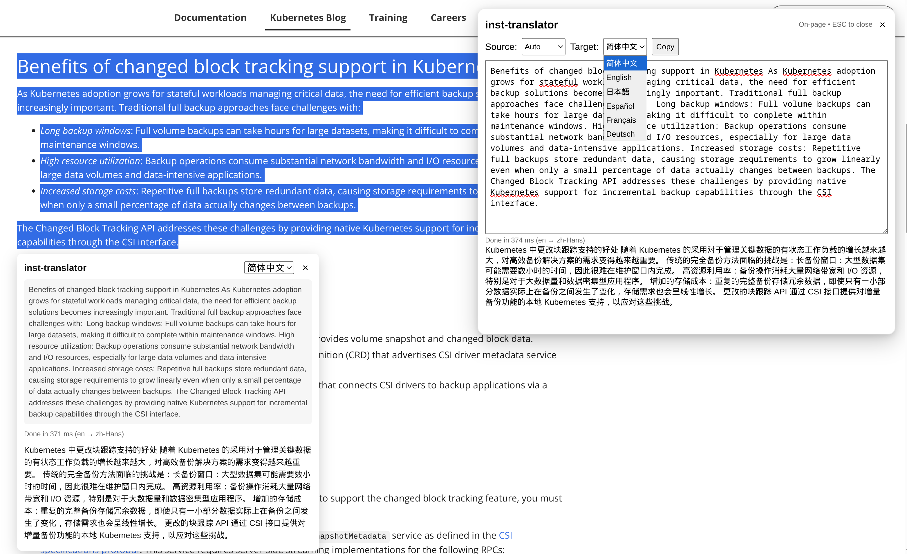

# inst-translator (Chrome Extension, Prompt API)

`inst-translator` is a Chrome extension that runs **fully on-device** using Chrome Built-in AI.

Current core stack:
- Prompt API (`LanguageModel`) for generation tasks
- LanguageDetector API for auto source-language detection (translate mode)
- MV3 extension + in-page overlay UI

## Screenshot



## Requirements

- Google Chrome **148+**
- A device/browser profile where Built-in AI is available

## Install (Load Unpacked)

Recommended:
1. `pnpm install`
2. `pnpm build`
3. Open `chrome://extensions`
4. Enable **Developer mode**
5. Click **Load unpacked** and select `dist/`

Dev watch mode:
1. `pnpm install`
2. `pnpm dev`
3. Load `dist/` in `chrome://extensions`
4. After code changes, click **Reload** on the extension card

## Usage

### Open UI
- Select text on a page → right-click → **Open inst-translator with selection**
- Or click the extension toolbar icon

### Action modes
- `translate`
- `summarize`
- `polish`
- `explain`
- `custom` (with custom instruction)

### Language options (current UI scope)
- Source: `auto / en / zh-Hans / ja / es / fr / de`
- Target: `en / zh-Hans / ja / es / fr / de`

> Note: Prompt API itself may support broader languages, but this project currently exposes only the options above in UI.

## Build/Runtime Notes

- First run may trigger model download; progress is shown in status text.
- The in-page overlay runs in an `about:blank` iframe and injects the `src/frame.html` template + extension scripts via `chrome.runtime.getURL(...)`.
- Resources embedded by normal pages must be listed in `web_accessible_resources` (for example `src/frame.html`, `src/popup.js`, `src/frame-boot.js`, `icons/*`).

## Project Structure

```text
inst-translator/
├─ manifest.json
├─ src/
│  ├─ ai.ts               # Prompt API wrapper (availability/session/prompt streaming)
│  ├─ popup.ts            # Shared action execution logic used by popup + iframe UI
│  ├─ overlay.ts          # In-page overlay host / iframe bootstrap
│  ├─ frame-boot.ts       # Frame bridge (focus/close/message)
│  ├─ frame.html          # Shared UI document for in-page iframe
│  ├─ background.ts       # Context menu + action click message dispatch
│  ├─ content.ts          # Selection text extraction helper
│  └─ overlay.css         # Overlay shell styles
└─ dist/                  # Built extension bundle
```

## Troubleshooting

- **`Denying load of chrome-extension://.../icons/icon32.png`** (or `src/frame.html`)
  - Cause: resource is loaded by page context but missing from `web_accessible_resources`.
  - Fix: add the resource (or wildcard like `icons/*`) into `manifest.json > web_accessible_resources[].resources`, rebuild, reload extension.

- Toolbar click has no effect
  - Ensure `dist/` is loaded (not source root).
  - Rebuild and reload extension.

- Built-in AI unavailable
  - Try a normal web page (not Chrome internal/restricted pages).
  - Confirm Chrome version and Built-in AI availability in your environment.

## Optimization ideas / Candidate features

1. **Language list auto-sync**
   - Query runtime availability and dynamically show only valid language options.
2. **Prompt templates**
   - Preset templates for email rewrite, PR summary, glossary-preserving translation.
3. **Output quality controls**
   - Add optional temperature/style/length controls per mode.
4. **History & pinned snippets**
   - Save recent runs and pin reusable custom prompts locally.
5. **Structured output mode**
   - For `custom`, optionally request JSON schema output and validate parse result.

## Acknowledgements

- [openai-translator](https://github.com/openai-translator/openai-translator/)
- [fancy-translator](https://github.com/daidr/fancy-translator)
